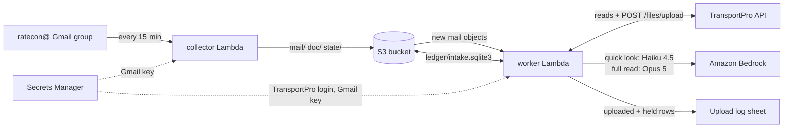
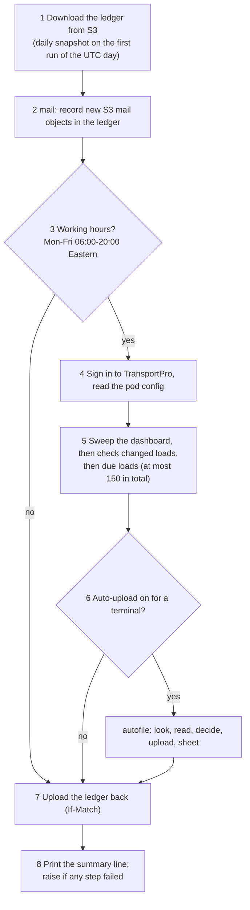
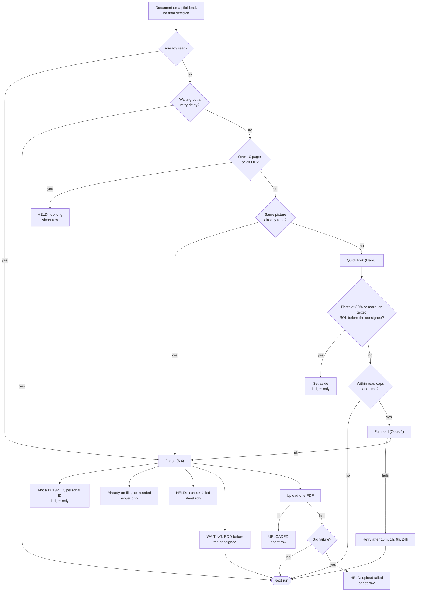

# How the Doc Intake Bot works: the pipeline, end to end

A handover guide for the next developer. It describes what runs in AWS as of 25 Sep 2026. The
[README](../README.md) covers the prototype and the local tools this grew out of. Where the two
disagree, this file describes production.

Times in logs, the ledger and the Upload log sheet are UTC. Working hours are US Eastern.

---

## 1. In one paragraph

Carriers and drivers email BOLs and PODs to the `ratecon@` Google Group. Every 15 minutes the
**collector** Lambda copies new mail and its attachments from Gmail into S3. Every 15 minutes the
**worker** Lambda does four things:

- records that mail in its **ledger**, a SQLite file kept in S3;
- checks the Load Management loads against TransportPro;
- for the pilot pod (Frankie Saiz, TransportPro terminal 1160), has Claude read the new paperwork
  and uploads the BOLs and PODs that pass every check;
- writes what it uploaded, or held back and why, to the pod's **Upload log** Google Sheet.

Nothing depends on one run finishing. Work a run doesn't reach stays recorded as undone, and the
next run picks it up. [Section 7](#7-when-the-bot-cannot-finish-how-work-carries-over) lists every
case.



Only the worker's auto-upload step calls a model or writes to TransportPro. Collection, ledger
bookkeeping and load checks run for all 16 pod terminals. Reading and uploading run for terminal
1160 only.

---

## 2. What runs where

| Piece | Name | Settings |
|---|---|---|
| Collector Lambda | `circle-doc-intake-collector` | python3.12, 512 MB, 10 min timeout, handler `intake.aws_lambda.handler` |
| Worker Lambda | `circle-doc-intake-worker` | python3.12, 1.5 GB, 10 min timeout, handler `intake.aws_worker.handler` |
| Schedules (EventBridge Scheduler) | `circle-doc-intake-every-15-min`, `circle-doc-intake-worker-every-15-min` | `rate(15 minutes)`, no retries |
| Concurrency | both functions | Reserved concurrency 1. A trigger older than 60 s is dropped, so a run that fires while another is going is skipped. The next quarter-hour is the retry. |
| Secrets | `circle-doc-intake/gmail-service-account` | Google service-account key: Gmail (delegated, read-only) and the Upload log sheet |
| | `paybot/prod/tp-password` | TransportPro password, shared with the pay-status bot. The worker only reads it. |
| | `INTAKE_TPRO_UPLOAD_SECRET` (optional) | the bot's own TransportPro login once it exists. Until then uploads go in as the reading login. |
| IAM roles | `circle-doc-intake-collector`, `-worker`, `-scheduler` | least-privilege policies are in `scripts/deploy_lambda.py` |
| Logs | `/aws/lambda/<function>` | 90-day retention; one JSON summary line per run |
| S3 bucket | `INTAKE_S3_BUCKET` in `.env` | kept out of this public repository |
| Upload log | `INTAKE_UPLOAD_SHEET_ID` in `.env`, tab `Upload log` | shared with the service account as an editor |
| Region | us-east-1 | the AWS account behind `AWS_PROFILE` in `.env`, shared with other projects |

Both functions run from the same zip (`deploy/collector.zip`). Each handler picks its entry point.

### The bucket

| Key | Written by | What it holds |
|---|---|---|
| `state/gmail-bookmark.json` | collector | Gmail `historyId` the collector has reached, plus the message ids already finished in an unfinished window |
| `mail/<yyyy>/<mm>/<dd>/<gmail-id>.json.gz` | collector | Each message: raw RFC822 (base64), an **envelope** (load, routing tier and reason, sender, date) and a **manifest** of every attachment, including the dropped ones and why |
| `doc/<ab>/<sha256>` | collector | Each kept attachment once, addressed by content hash. The same BOL forwarded five times is one object. Tagged `pii=unchecked`. |
| `ledger/intake.sqlite3` | worker | the ledger (section 8) |
| `ledger/snapshots/intake-<day>.sqlite3` | worker | a copy taken before the first run of each UTC day |
| `config/pod_terminals.json` | `deploy_lambda.py config` | the pod terminals and the dashboard filter (Circle data, so not in the repo) |
| `deploy/collector.zip` | `deploy_lambda.py deploy` | the code |

Lifecycle rules are applied; see `deploy_lambda.py lifecycle`:

- `mail/` and `doc/` move to Glacier Instant Retrieval after 90 days and are deleted after 1,095 days.
- `doc/` objects tagged `pii=true` are deleted after 90 days.
- Snapshots are deleted after 30 days.

---

## 3. One collector run: Gmail to S3

Code: [`intake/aws_lambda.py`](../intake/aws_lambda.py) → [`intake/collector.py`](../intake/collector.py) `run()`.

1. **Read the bookmark** (`read_bookmark`), keeping its ETag. A missing bookmark is an error,
   never a fresh start.
2. **List what's new.** Call `gmail.history_since(historyId)`. Gmail keeps about a week of history.
   If the bookmark is older than that (`CursorTooOld`), the collector does a **re-walk** instead: it
   searches `to:ratecon@… newer_than:<N>d` over the whole gap, sized from the bookmark's `taken_at`.
3. **Skip** message ids in the bookmark's `stored` list. An earlier run of the same window already
   finished them.
4. **For each message**, up to 400 a run (`INTAKE_MAX_MESSAGES`) and until 30 s before the timeout:
   1. Fetch it raw. A 404 means it was deleted; it's counted as vanished.
   2. **Route it to a load** ([`routing.py`](../intake/routing.py)), in this order:
      - exactly one 7-digit load number (`24xxxxx`–`26xxxxx`) in its own subject (tier `subject`);
      - otherwise, the earliest earlier message in the same Gmail thread that names exactly one
        load (tier `thread`);
      - otherwise, a single load number in the body snippet;
      - otherwise, **unresolved**.

      A subject naming several loads counts as ambiguous, not decisive.
   3. Take every attachment-like part, largest first, at most 12. The rest are marked `over_part_cap`.
   4. **Free filters** ([`filters.py`](../intake/filters.py)). Everything not dropped here is kept.

      | Rule | Dropped as |
      |---|---|
      | no filename, or under 40 KB | `too_small` |
      | TransportPro's own `<fileId>_<typeId>.pdf` with a rate-confirmation type (23, 143, 358, 367) | `rate_confirmation` |
      | image under 300 px on a side, under 150,000 px in area, or wider than 2.2:1 | `signature_or_logo` |

   5. Store each kept part at `doc/<sha256>`, skipped if it's already there. Documents are written
      **before** the mail object, so a mail object never names a document that isn't stored yet.
   6. Store the mail object, with its envelope and manifest.
5. **Move the bookmark** (`write_bookmark`, conditional on the ETag from step 1):
   - Everything listed was done: move to Gmail's latest `historyId` and empty `stored`.
   - The run stopped early (cap, time or error): keep the same `historyId` and save the finished
     ids in `stored`.
6. Print the summary line. If the run stopped on an error, raise, but only after the bookmark is
   saved, so the Lambda Errors metric sees it without losing what did go through.

Here is a summary line as it appears in the logs:

```
history: 42 listed | 42 fetched | 42 mail stored | 41 on a load (3 via their thread), 1 with no load number
| documents 2 stored, 21 already there | parts kept 23, dropped: too_small 22, rate_confirmation 4, signature_or_logo 3
| bookmark 10691452 -> 10694765
```

The collector never calls a model, never calls TransportPro and keeps no ledger.

---

## 4. One worker run

Code: [`intake/aws_worker.py`](../intake/aws_worker.py) `handler()`.



**Time budget.** Lambda gives the run 600 s. The worker keeps 60 s back for uploading the ledger,
so its working deadline is about 540 s in.

| Stage | Stops |
|---|---|
| mail | at 40% of the run, about 216 s |
| load checks | at 150 loads (`INTAKE_LOAD_LIMIT`); no time limit of their own |
| auto-upload: looking at loads | 240 s before the deadline |
| auto-upload: quick looks and full reads | 120 s before the deadline; unfinished reads are abandoned |
| auto-upload: starting an upload | not with less than 45 s to the deadline |
| handing the ledger back | the 60 s reserve |

If the load checks run long, auto-upload gets less time. Nothing is lost; the rest carries over.

**The steps:**

1. **Take the ledger** ([`ledger_s3.take`](../intake/ledger_s3.py)). Download
   `ledger/intake.sqlite3` to `/tmp` and keep its ETag. A missing ledger is an error, never an
   empty start: an empty ledger would re-read every document and then overwrite the real one.
   The first run of each UTC day copies the ledger to `ledger/snapshots/`, because the bucket has
   no versioning.
2. **mail** ([`mailsync.ingest_recent`](../intake/mailsync.py)).
   - List `mail/` for the last 7 UTC days (`INTAKE_MAIL_DAYS`) plus `mail/unknown/`. The count
     drops at UTC midnight when the window moves on.
   - Skip every message id already in the `message` table.
   - For each new object, write from its envelope and manifest alone:
     - `thread` and `message` rows;
     - one `part` row per attachment, with the filter's decision;
     - one placeholder `attachment` row per new SHA-256, unread;
     - the thread's binding to the load.
   - Pull the load's next check forward to **now**.
   - Mail with no load number: its kept parts are recorded as `pending` and the message goes on the
     `unresolved` list.
   - No Gmail, TransportPro or model calls.
3. **Working-hours gate.** 06:00–20:00 `America/New_York`, Monday–Friday (`INTAKE_ACTIVE_HOURS`,
   `INTAKE_ACTIVE_DAYS`). Outside that window the run stops after the mail step and goes straight
   to step 7, so no loads are checked and nothing is uploaded.
4. **Set up.** Sign in to TransportPro and read `config/pod_terminals.json`. That file holds the 16
   pod terminals ticked on the Load Management view and the in-scope service level, Priority / OP8.
5. **Loads** ([`loadloop.py`](../intake/loadloop.py)).
   - **Sweep** (`reconcile`) reproduces the Load Management view.
     - It runs `/load/search` per terminal, status Dispatched, pickups 42 days back to 45 days
       ahead. Windows are 45 days, and a window the API rejects is split in half, not skipped.
     - It drops cancelled loads and other service levels. Every load left gets a ledger row with
       `in_view=1`; new rows are due now.
     - Loads whose TransportPro document status changed since their last check are collected as
       **changed**.
   - **The first run of each Eastern day is the full sweep**, 350 days back. It is the only sweep
     allowed to evict loads that have left the view. It skips the regular check that run.
   - **changed**: those loads are checked straight away.
   - **check** (`drain`): loads with `next_check_at <= now` and in view, oldest due first, up to
     150 minus the changed ones.
   - **One check** is three reads: `/load/{id}`, `/dispatch/search` and `/files/search`. It feeds
     [`state.assess`](../intake/state.py), which writes back the state, a reason in words and the
     next check time (section 5).
6. **auto_upload** ([`autofile.run`](../intake/autofile.py)), for the terminals in
   `INTAKE_AUTO_TERMINALS` when `INTAKE_AUTO_UPLOAD` is `on` or `dry-run`. See section 6.
7. **Hand the ledger back** ([`ledger_s3.give_back`](../intake/ledger_s3.py)).
   - Fold the WAL into the file and run `PRAGMA quick_check`.
   - Upload only over the ETag taken in step 1. If anything replaced the ledger in between, the
     upload is refused (`LedgerChanged`) and the run fails loudly instead of overwriting.
8. **Print the summary** line. If any step failed, raise after the ledger is saved.

Steps fail independently through the `step()` wrapper. If TransportPro is down, mail is still
recorded and the ledger still goes back.

---

## 5. Load states and how often each is checked

From [`state.py`](../intake/state.py). What a load needs depends on the truck's stage. It needs the
BOL from the moment the truck is at the shipper, and the POD once it reaches the consignee.

Only three TransportPro file types clear **Waiting for Documents**: 12 Bill Of Lading, 360 Proof of
Delivery and 53 Delivery Receipt. Type 363 Driver Supplied BOL does not clear it. TransportPro
itself files a driver's texted photo as 363, which is why so many loads sit waiting with their
paperwork already on them.

| State | Meaning | Re-checked | Auto-upload looks at it? |
|---|---|---|---|
| `new` | row created, not checked yet | due now | no (no stage to judge by) |
| `not_yet_due` | truck hasn't reached the shipper | 6 h | yes |
| `bol_expected` | at the shipper or later, before the consignee, no BOL or POD filed | 1 h | yes |
| `pod_expected` | at the consignee or delivered, nothing filed | 15 min | yes, first |
| `wrong_doc_type` | only non-clearing types filed | 1 h | yes |
| `filed_status_pending` | a clearing type filed, status still Waiting | 1 h | yes |
| `pod_mislabelled` | a read POD sits on the load under a type that doesn't say POD | 1 h | yes |
| `pod_unverified` | Documents Received on a POD claim nobody has read | 6 h | yes |
| `pod_unsigned` | Documents Received, but the POD on file has no receiver signature or stamp | 24 h | yes |
| `complete` | Documents Received | never | no |
| `out_of_scope` | service level not in scope | 24 h | no |
| `error` | a TransportPro read failed | 1 h | no |
| `not_in_view` | left the Load Management view | never | no |

Auto-upload works loads in this order: `pod_expected`, `pod_unsigned`, `pod_mislabelled`,
`pod_unverified`, `wrong_doc_type`, `filed_status_pending`, `bol_expected`, `not_yet_due`
(`autofile.LOAD_ORDER`), then by `next_check_at`.

---

## 6. Auto-upload, step by step

Code: [`intake/autofile.py`](../intake/autofile.py). The house rules are in its docstring: only
BOLs and PODs are ever uploaded or logged, and a POD goes in as Bill Of Lading. Read the docstring
before changing anything here.

### 6.1 Which loads get looked at

A load qualifies when all of these hold:

- it's in view;
- it's on a pilot terminal;
- it's in one of the `LOAD_ORDER` states.

A qualifying load is looked at this run when any of these is true (`_worth_a_look`):

- the bot has never looked at it;
- the load check has seen it since the bot last looked (`load.last_checked_at > autofile_load.looked_at`),
  so its stage or File History may have moved;
- an emailed document on it has no final decision yet;
- auto-upload was just switched from dry-run to on, and a dry run left an upload it only described.

### 6.2 Look (`_look`)

1. `GET /load/{id}`. If it shows Documents Received, mark it looked and move on.
2. `GET /files/search`. Every paperwork file on the load (types 12, 363, 360, 53, 123) is downloaded
   **once**, hashed, and turned into a 32×32 greyscale thumbnail per page. The results are cached
   in `tpro_file` and `picture_sig`.
3. Build the list of **documents to decide about**:
   - every kept attachment on mail routed to this load, de-duplicated by SHA-256, in the order the
     emails arrived;
   - every Driver Supplied BOL on the load that the bot didn't upload and that isn't the same bytes
     as an emailed file. This is how texted pictures come in: TransportPro files a driver's MMS
     picture itself, as user 1, with the comment "Driver Supplied Image".
   - Anything that already has a **final** decision in the `autofile` table is left out.
4. If there's nothing to decide, mark the load looked.

### 6.3 Read (`_read`): the cheapest reading each page can get

Each document without a reading goes down this ladder:

| # | Step | Cost |
|---|---|---|
| 0 | Still waiting out a failed read's retry delay? Skip it, and leave the load for the next run. | – |
| 1 | Get the bytes: from S3 `doc/` for email (checked against the SHA-256), from TransportPro for a file on the load | free |
| 2 | **Too long?** Over 10 pages (`MAX_READ_PAGES`) or 20 MB: recorded as a permanent failure, "too long for the bot", and **held for a person**. It is never sent to the AI. | free |
| 3 | **Same picture already read on this load?** (every page within a mean difference of 3.0 of a read document's pages) Copy that reading. | $0 |
| 4 | **Quick look**: Claude Haiku 4.5, first 3 pages at 1,100 px, 4 in parallel, 60 s timeout. Answers `pod`, `bol`, `other_paperwork`, `photo` or `not_freight`, with a confidence. Stored in `quicklook`. | ~$0.002 |
| 5 | **Skip the full read** only when the quick look says `photo` or `not_freight` at 80% or more, or when the page is already on the load (a texted picture), the truck isn't at the consignee, and the quick look called it `bol`, `other_paperwork`, `photo` or `not_freight`. A texted POD pulls the other pictures from its text batch into the full read. | – |
| 6 | **Full read**: Claude Opus 5 on Bedrock, effort `low`, brief notes, up to 10 pages at 1,568 px, 3 in parallel, 120 s timeout. Returns the `Extraction` in [`pod_intake/schema.py`](../pod_intake/schema.py). Stored in `attachment.extraction_json`. | ~$0.04 |

The full read returns:

- the document type and a confidence;
- every reference number, with its label and kind;
- shipper and consignee;
- signatures (shipper, driver, receiver) and whether there's a receiving stamp;
- in/out times, and which stop they were recorded at;
- pieces and weight;
- each page's role;
- short notes.

The quick look is trusted only to set aside photos, never to decide a page isn't a POD. It once
called a signed POD page an unsigned BOL.

**Read caps:**

- at most 60 full reads a run (`INTAKE_AUTO_MAX_READS`);
- the day's estimated spend under $50 (`INTAKE_AUTO_DAILY_USD`), counted per UTC day in
  `worker_state` under `ai_spend:<day>`. How many reads still fit is worked out at $0.04 each.

The provider, model id prefixing and the structured-output fallback live in
[`pod_intake/provider.py`](../pod_intake/provider.py) and [`pod_intake/reader.py`](../pod_intake/reader.py).
Page rendering is in [`pod_intake/normalize.py`](../pod_intake/normalize.py); iPhone HEIC photos
are converted to JPEG first.

### 6.4 Decide (`_decide`, then `judge`)

**Is it a BOL or a POD?** `pod_intake.matcher.classify_type` decides from the reading and the
truck's stage.

- A page the receiver signed is treated as a POD.
- It still has to wait for the consignee stage before it can go up (the WAITING row in the table
  below).

**The checks,** in order; the first rule that matches decides:

| Rule | Outcome | On the sheet? |
|---|---|---|
| too long, not read | **held** | yes |
| can't be read: all retries used, or a permanent failure | unreadable | no |
| not read yet | no decision this run | – |
| quick look settled it: a texted BOL | on_file | no |
| quick look settled it: anything else it set aside (a photo, not freight, other paperwork) | not_bol_pod | no |
| personal ID on the page (licence, passport and similar) | personal_id | no, never uploaded |
| the AI read it as `other` or `unknown`, or as anything but a BOL or POD (lumper, packing list, photo…) | not_bol_pod | no |
| **already on the load**: the same bytes, or the same picture page for page, under a type that counts (any paperwork type for a BOL; a clearing type for a POD). Only the file's BOL and POD pages are compared, because those are the only pages an upload carries. | on_file, or uploaded if it's the bot's own earlier upload | no (an upload: yes) |
| **the load already has one**. For a BOL: type 12, or a Driver Supplied BOL that reads as a BOL or POD. For a POD: type 360 or 53, or type 12 with a POD comment or that reads as a POD. | not_needed | no |
| a Driver Supplied BOL on the load isn't read yet, so there's no telling whether a BOL is there | no decision this run | – |
| **any check fails** (next table) | **held** | yes |
| a POD, but TransportPro doesn't have the truck at the consignee or delivered | **waiting** (not final) | no |
| otherwise | ready to upload | – |

**The checks behind "held":**

| Check | Default |
|---|---|
| The AI's confidence in the document type | at least 85% (`INTAKE_AUTO_MIN_CONFIDENCE`) |
| Facts on the page that match the load | at least 2 (`INTAKE_AUTO_MIN_FACTS`), one of them a reference number |
| The email thread | no reply may name a different load |
| A page the AI called a POD | must show a receiver signature, stamp or delivery time |
| A POD | needs a receiver signature or stamp. An in/out time alone isn't enough: on load 2562069 it was the truck's dashboard clock. |

**Matching facts** (`match_facts_detail`) compares every number on the page with the load.

- Strong facts (reference numbers): load #, pickup #, PO #, reference #, manifest #, EDI reference #,
  BOL #, seal #, container #, and the stops' reference numbers.
- Weak facts: pieces, weight, and the shipper or consignee city.
- Exact matches are tried first. Then loose ones: one number contains the other (6 or more
  characters), or they share a core of 5 or more digits with only letters around it, so
  `PO18650` = `18650`.

**Final decisions are never re-decided.** Held, on_file, not_needed and uploaded are final
(`autofile.final = 1`). Only waiting, and dry-run rows, are looked at again. A held row on the sheet
is the hand-off to a person.

### 6.5 Grouping pages into one upload

- Pages that arrive together are a **batch**:
  - one email is one batch (`email:<message id>`);
  - pictures a driver texted within 180 s of each other, chained, are one batch (`text:<first file id>`).
    TransportPro files each picture as its own Driver Supplied BOL.
- Each ready POD, then each ready BOL, takes its **companions** from its batch (`companions`, `can_join`). A page joins when either:
  - it passes on its own and shares a reference number with the set, or
  - it's a sign-out side with no reference number at all, the AI is at least 60% sure of it, and
    only the facts and confidence checks failed.
- A second shot of a page already in the set stays out.
- Texted pages decided in an earlier run are judged again (`_batch_mates`), so page 1 can still go
  up with a page 2 that arrived later.

### 6.6 Upload (`_upload`)

1. **Look again, just before uploading.** Fetch `/load` and `/files` fresh. If the load now shows
   Documents Received, the page is not needed.
2. **Judge every page again** against the fresh File History; someone may have filed it since.
3. **Build one PDF, from the BOL and POD pages only** (`paper_pages`, `only_pages`). A page the
   reading labels as a photo, a lumper receipt, a packing list or any other paperwork is left out,
   and the sheet's Document(s) column names it: `BOL.pdf (left out: page 2 photo, page 3 photo)`.
   A page the reading didn't label is kept. A POD always keeps the page with the receiver's
   evidence: if none of its kept pages is labelled `pod`, only its photos are left out. On load
   2590747 the consignee's stamp was on a packing list, not the BOL. A PDF that keeps every page
   goes up as it arrived.
   Photos, HEIC files and multi-page sets are combined with PyMuPDF. This rule has applied since
   25 Sep 2026; before it, 8 of the first 21 uploads carried such pages.
4. **Type**, set in `filing.FILE_AS` by the manager's rule of 24 Sep 2026:
   - a **POD** goes in as **Bill Of Lading** (12), which clears Waiting for Documents;
   - a **BOL** goes in as **Driver Supplied BOL** (363), which doesn't.
5. **Comment**: what the page really is, for example `Doc Intake Bot: POD, signed by M PRI 9/24, 2 pages - load 2572862`.
   When the upload is a copy of a file already on the load, the comment says so:
   `copy of Driver Supplied BOL 31442466 + 31442467`.
6. `POST /files/upload` ([`tpro.py`](../intake/tpro.py) `upload_file`). It is retried only once, and
   only on a 401: a retry after a 500 could file the document twice.
7. **Check afterwards** that the new file is listed in `/files/search`. Then record it in:
   - `tpro_file`;
   - `filing`, whose unique key (load, sha256) is the guard against double filing;
   - `notification`, which is recorded only; nothing is sent;
   - the `autofile` rows.

   Finally, set the load's next check to now so the load check sees the change.

In `dry-run` mode nothing is uploaded and no sheet rows are written. Decisions are recorded as
`dry_run`, which is not final.

### 6.7 The Upload log sheet (`flush_log`, [`sheets.py`](../intake/sheets.py))

- Only **uploaded** and **held** rows go to the sheet, one row per upload. The lead page carries
  the list of every page in it.
- Columns A–N are the bot's. Columns O (`Correct? (pod)`) and P (`Pod note`) belong to the pod and
  are never written. Column Q is the Ref, `<load>-<sha256[:12]>`. Rows are found by Ref, never by
  row number, so the pod can sort and filter the tab safely.
- A row is rewritten only when its status changes; `autofile.logged_status` records what the sheet
  last showed.
- A row that should no longer show, such as a page that went up inside another row, is deleted,
  unless the pod has written something in O or P.

---

## 7. When the bot cannot finish: how work carries over

**The rule:** no work is ever half-done between runs. Every piece of work is either recorded as
done, or still visibly undone in S3 or the ledger, and every run starts from what is recorded. A
run can stop anywhere, even be killed, and the next one simply does the rest. Replays are cheap
because every write is keyed by content or id: the same message or document stored twice is one
object, and the same file read twice is one paid read.

### Collector

| Situation | What is kept | What happens next |
|---|---|---|
| 400-message cap, time limit, or a Gmail/S3 error part-way | The bookmark stays at the same `historyId`; the finished message ids go in `stored` | The next run lists the same window, skips `stored`, and carries on |
| Bookmark older than Gmail's ~7-day history | – | Re-walk by search over the whole gap; objects already stored are skipped by key |
| Two runs overlap (shouldn't happen with concurrency 1) | The second bookmark write is refused (`BookmarkChanged`) | The objects stored stand; the next run carries on |

### Worker: mail step

| Situation | What is kept | What happens next |
|---|---|---|
| Out of time at 40% of the run | Unrecorded objects stay in S3 | Listed again next run; the 7-day window covers them |
| Worker stopped for more than 7 days | Older mail is outside the listing window | Raise `INTAKE_MAIL_DAYS` for one run |
| Message with no load number | Parts `pending`, message on `unresolved` | **Not retried in AWS**; see section 11 |

### Worker: load checks

| Situation | What is kept | What happens next |
|---|---|---|
| Outside working hours or days | Mail still recorded; every load that got mail is due now | Checked from 06:00 Eastern on the next working day |
| More loads due than the 150 cap | `next_check_at` unchanged | Oldest due first on the next run: a backlog delays a load, it never drops one |
| TransportPro error on a load | `state=error`, next check in 60 min | Checked again; it stays in the counts so failures show as lag |
| The day's full-sweep run | No regular checks that run | The next run checks |

### Worker: auto-upload

| Situation | What is kept | What happens next |
|---|---|---|
| Out of time while looking at loads | The loads not reached aren't marked looked | Looked at next run |
| A document's bytes can't be fetched | Load left unread (not marked looked) | Tried next run |
| Over 10 pages or 20 MB | **Held**, with a sheet row | Never read by the bot. A person files it. |
| Same picture as a page already read | The reading is copied | – |
| Quick look fails (a timeout, HTTP 413, a file it can't open) | Nothing | The full read decides in the same run |
| Read cap reached (60 a run, or $50 a UTC day) | Load left unread | Next run, or the next UTC day |
| A full read not back 120 s before the deadline | Abandoned, load left unread | Read again next run. The abandoned call may still be billed. |
| A full read fails | `attachment.error`; retries after **15 min, 1 h, 6 h and 24 h** (`db.READ_RETRY_MINUTES`) | Retried automatically. After the last retry fails it's **unreadable** and never logged. |
| Reader unavailable (billing, quota, key, permission) | Paused 60 min; the retry count is not used up | Retried until the reader works again |
| Re-fetched bytes don't match the hash | Permanent failure | Never retried |
| No reading yet | No `autofile` row | Decided once it's read |
| An unread Driver Supplied BOL blocks "does the load have a BOL?" | No decision | Decided once that file is read |
| POD, but the truck isn't at the consignee in TransportPro | **Waiting** (`final=0`) | Decided again whenever the bot looks at the load: after each load check, or when new mail arrives |
| Out of time before deciding or uploading | – | Next run |
| The upload call fails | **Waiting**, `attempts+1`; on the 3rd failure, **held** | Retried next run after a fresh File History check |
| Upload accepted but not listed in File History yet | Uploaded, with a note in the status | – |
| Sheet write fails | Rows stay pending (`logged_status != status`); the run reports `upload_log` failed | Written next run |

### The whole run

| Situation | What is kept | What happens next |
|---|---|---|
| Ledger upload refused (ETag changed) | Nothing from this run | The next run redoes it. Any upload it made is found on the load (the bot's own file, same bytes or same picture) and is **not uploaded again**. |
| Lambda killed: timeout or out of memory | Nothing from this run | Same as above. On 24 Sep 2026 a 27-page scan ran the 1 GB worker out of memory; the page limit and 1.5 GB came from that. |
| Trigger fires while a run is going | Dropped | The next quarter-hour |

**How a load is sure to be looked at again.** A load with anything unread or an error goes into
`autofile.run`'s `unread` set and is **not** marked looked (`_mark_looked` is skipped). So
`_worth_a_look` stays true until everything on it has a reading and a decision.

### The life of one document



---

## 8. The ledger

One SQLite file ([`intake/db.py`](../intake/db.py), schema version 15), about 32 MB as of 25 Sep 2026.
The ledger is the index; S3 is the archive. Two rules carry it:

- `part` is one row per **occurrence** of an attachment, and `attachment` is one row per **unique
  SHA-256**. So the ledger can prove de-duplication worked.
- The reading is cached, because it depends only on the bytes. The filing decision is never cached,
  because it depends on the load's current stage and File History.

| Table | One row per | Used for |
|---|---|---|
| `message` | Gmail message | routing (load, tier); `message_seen` makes a replay free |
| `thread` | Gmail thread | the load a thread is bound to |
| `part` | attachment occurrence | the filter decision (`keep`, `too_small`, …) and its SHA-256 |
| `attachment` | unique file | the reading (`extraction_json`), cost, error and retry state (`read_attempts`, `next_read_at`) |
| `quicklook` | unique file | what the quick look called it |
| `picture_sig` | unique file | per-page thumbnails for "same picture" checks |
| `tpro_file` | file on a load in TransportPro | its type, comment, uploader and hash |
| `load` | load | state, stage, reason, `next_check_at`, `last_checked_at`, `in_view` |
| `autofile` | (load, document) | the bot's decision: outcome, `final`, status text, sheet row, file id, upload attempts |
| `autofile_load` | load | when the bot last looked at it |
| `filing` | (load, document) uploaded | the double-filing guard |
| `notification` | event on a load | what the team would be told (recorded, not sent) |
| `unresolved` | message with no load | the list a person works |
| `worker_state` | key | `full_sweep_day`, `reconcile_at`, `ai_spend:<day>` |
| `review`, `mailbox_cursor` | – | the local review queue and Gmail cursor; not used by the Lambdas |

**Inspecting the live ledger.** Download a copy and point the local CLI at it with `--db`. Never
upload a modified copy. The worker's If-Match would refuse it anyway, and `seed-ledger` refuses to
overwrite.

```powershell
aws s3 cp s3://<bucket>/ledger/intake.sqlite3 $env:TEMP\ledger.sqlite3 --profile <profile>
.venv\Scripts\python.exe -m intake --db $env:TEMP\ledger.sqlite3 status
.venv\Scripts\python.exe -m intake --db $env:TEMP\ledger.sqlite3 load 2572862
```

Some useful queries against the copy:

```sql
-- today's auto-upload decisions
SELECT outcome, COUNT(*) FROM autofile WHERE decided_at >= date('now') GROUP BY outcome;
-- what was held, and why
SELECT load_id, status FROM autofile WHERE outcome = 'held' ORDER BY decided_at DESC;
-- reads that are failing and when they are next tried
SELECT filename, error, read_attempts, next_read_at FROM attachment WHERE error IS NOT NULL AND extraction_json IS NULL;
```

---

## 9. Operating it

All commands run from the repository root, with `.env` filled in and `aws sso login --profile <profile>` done.

| Command | What it does |
|---|---|
| `python scripts/deploy_lambda.py status --fn worker` (or no `--fn` for the collector) | function state, schedule state and the last runs' summary lines |
| `python scripts/deploy_lambda.py invoke --fn worker` | run one now and print its log |
| `python scripts/deploy_lambda.py autoupload on\|off\|dry-run` | switch uploads without a redeploy |
| `python scripts/deploy_lambda.py schedule on\|off --fn worker` | start or stop a function's schedule |
| `python scripts/deploy_lambda.py deploy` | build Linux wheels, upload the zip, update both functions. Schedules keep their state. |
| `python scripts/deploy_lambda.py config` | upload `index/pod_terminals.json` to `config/` |
| `python scripts/deploy_lambda.py lifecycle [--apply]` | show or set the S3 retention rules |
| `secret`, `seed-ledger`, `bookmark` | one-time setup; each refuses to overwrite what's there |

**Deploy re-reads `INTAKE_AUTO_UPLOAD` from `.env`**, and the default is `on`. If you switched
uploads off with `autoupload off`, a deploy turns them back on unless `.env` also says `off`.

**Reading the worker's summary line.** The `auto_upload` part looks like this:

```
auto-upload (on): 36 load(s) looked at, 58 quick look(s), 30 full read(s), 1 reading(s) reused ($1.46; $11.43 today),
4 upload(s) of 4 document(s) | held 3, not bol pod 31, not needed 2, on file 19, uploaded 4 | 28 sheet row(s) written
| 1 read(s) failed
```

- `$… today` is the bot's own estimate at first-party list prices. Bedrock bills separately, so
  check the real figure in Cost Explorer.
- `stopped: …` means work was carried over; it says why.
- `SHEET FAILED` means the sheet rows are pending.

Also in the worker's summary:

- `failed: []` must be empty; anything in it made the run raise.
- `loads_in_view` counts in-view loads by state.

**Warnings** are log lines starting with `  ! `, for example
`! auto-upload: quick look on <file>: <error>`. Lambda's `REPORT` lines show the memory used
against the memory size, and `Status: error` with `Error Type` on a crash.

**A health check:**

1. `status --fn worker` and `status`. Is there a run every 15 minutes, with `failed: []`?
2. CloudWatch Logs Insights or `filter_log_events` over the day: `  ! ` lines, and `REPORT` lines
   with `Status: error` or memory close to the limit.
3. Lambda metrics: Errors, Throttles, Duration against 600 s.
4. A copy of the ledger: today's `autofile` outcomes, held rows, failing reads.
5. Spot-check a few loads in TransportPro: files with comments starting `Doc Intake Bot:`.

**Cost.** Through 24 Sep 2026 the project cost about $39 in AWS, almost all of it Opus 5 reads.
With the quick look and the brief read, the pilot pod should run about $15–25 a month. The AWS
account is shared with other projects, and the `project=circle-doc-intake` tag isn't a
cost-allocation tag. To measure spend, use Cost Explorer's resource-level view for the Lambdas,
bucket and secrets, plus the "Claude Opus 5 (Amazon Bedrock Edition)" service line.

**Tests.** `.venv\Scripts\python.exe tests\test_intake.py` runs 475 offline checks: no network, no
model, no credentials. Run it before every deploy.

**Changing the pilot's pods.** Change `AUTO_TERMINALS` in `scripts/deploy_lambda.py` and deploy.
The sheet has a Pod column, so one sheet serves several pods.

---

## 10. Code map

**What the Lambdas run**

| File | Role |
|---|---|
| `intake/aws_lambda.py` | collector entry point |
| `intake/collector.py` | Gmail → S3, the bookmark |
| `intake/gmail.py` | delegated Gmail client (history, search, message, thread) |
| `intake/routing.py` | message → load |
| `intake/filters.py` | the free size and shape filters |
| `intake/store.py` | S3 keys and writes |
| `intake/aws_worker.py` | worker entry point: steps, working hours, time budget |
| `intake/ledger_s3.py` | take, snapshot and give back the ledger |
| `intake/mailsync.py` | S3 mail objects → ledger |
| `intake/loadloop.py` | sweep (`reconcile`), `drain`, `check_loads` |
| `intake/state.py` | load states, clearing types, cadence |
| `intake/tpro.py` | TransportPro client; `upload_file` is the only write |
| `intake/autofile.py` | auto-upload: look, read, decide, group, upload, log |
| `intake/ingest.py` | `make_reader`, `make_quick_reader`, retry classification |
| `intake/filing.py` | `FILE_AS` (the upload types), personal-ID detection, thread routing lookup |
| `intake/sheets.py` | the Upload log tab |
| `intake/notify.py` | notification records (nothing is delivered) |
| `intake/db.py` | the ledger schema and queries |
| `pod_intake/provider.py` | Bedrock, Anthropic or OpenRouter client and model ids |
| `pod_intake/reader.py` | the prompts, the quick look, the full read, cost estimates |
| `pod_intake/normalize.py` | PDF and photo → page images |
| `pod_intake/schema.py` | the `Extraction` schema |
| `pod_intake/matcher.py` | `classify_type`, page comments |
| `scripts/deploy_lambda.py` | build, deploy and operate |

**Local tools, not run in AWS:** the `intake` CLI (`python -m intake …`: `status`, `load`, `queue`,
`backfill`, `reconsider`, `tpro-scan`, `file`, `review`, `export`…), `readiness.py`, `run.py`,
`read_attachments.py`, `mail_survey.py`, `evaluate.py`, `compare.py`. Also `intake/archive.py`,
`intake/review.py`, `intake/export.py`, `intake/tprodocs.py` and `pod_intake/requirements.py`. The
README describes them. The customer-requirements rules and the review queue are not part of the
production path.

---

## 11. Known gaps and open items (25 Sep 2026)

- **Weekends and nights.** Loads are checked and uploads happen Monday–Friday, 06:00–20:00 Eastern
  only. Mail is still collected, and those loads are due first thing on the next working day.
- **Unresolved mail isn't retried in AWS.** A message with no load number in its subject, thread or
  body waits on the `unresolved` list. Matching it by the numbers on the paper exists
  (`routing.resolve_from_paper`) but isn't wired into the Lambdas.
- **No mail backfill in AWS.** The collector only sees mail from its bookmark onward. Older mail for
  a load is only there if the local `intake backfill` was run before the move to AWS.
- **Subject and thread conflicts aren't detected for mail collected in AWS.** The collector only
  looks at the thread when the subject has no single load number, so the check "a reply in the
  email thread named a different load" can't fire for that mail.
- **Audio and video attachments pass the filters.** The filters look at size and image shape, not
  file type. A voicemail `.mp3` over 40 KB is kept, fails at read time (for free: the failure is
  local, before any model call), is retried four times, and ends up unreadable. A type check in
  `filters.py` would stop this.
- **Personal-ID pages aren't retagged in S3.** The worker keeps readings in the ledger only, so
  `doc/` objects stay `pii=unchecked` and the 90-day personal-ID lifecycle rule never applies to
  them. Only the local `intake archive` command retags. The worker's IAM policy has no
  `PutObjectTagging` on `doc/`.
- **The bot's own TransportPro login is pending.** Uploads go in as the reading login until an
  admin creates the "Doc Intake Bot" user and its secret is set as `INTAKE_TPRO_UPLOAD_SECRET`.
- **The API can't delete or retype files.** A wrong upload needs a person. Waiting for deletion:
  31451927 on load 2577917 (the one-page copy, replaced by 31453237) and 31447880 on load 2562005
  (a POD filed as Driver Supplied BOL).
- **The pod still uploads by hand.** On 24 Sep 2026, on 8 of the 14 loads the bot uploaded to,
  someone uploaded the same BOL or POD 15–60 minutes later.
- **Spend in the ledger is an estimate** at first-party list prices (`pod_intake/reader.py` `PRICES`).
- **Size limits to watch.** The Lambda package is about 200 MB of the 250 MB limit. The ledger is
  one file, downloaded and uploaded on every run, and it grows.
